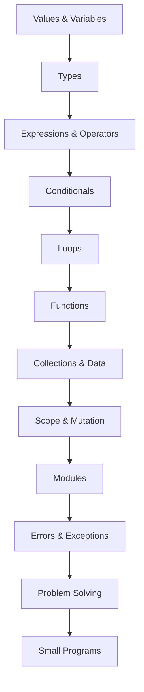

# 01 - Programming

*`00-foundations/01-programming/`, part of [Unslop](https://github.com/sage9705/unslop): don't be a vibe coder forever.*

## Overview

This section builds the programming skills you will rely on throughout Unslop.

Unslop exists to help early career developers break away from over relying on AI code generation, well before they have built the mental models that make someone a true engineer. This section is where that shift starts. Your main focus here isn't memorizing Python syntax or racking up completed exercises. Instead, it is about building the confidence to analyze a problem, break it into manageable pieces, write a working solution, run it, and independently figure out why it works or why it doesn't.

Every example and project in this section stems from a single real-world scenario: running a small shop. Retail isn't special, but it is intuitive to almost everyone. Stock runs low, customers pay for items, and mistakes cost real money. Concepts stick much better when tied to scenarios that feel real. A variable holding a random made up name is easy to forget; a variable holding a price that directly affects a customer's total is not.

By the end of this section, you will be able to open a blank file and write a program from scratch without needing AI to generate it for you, building real solutions for actual problems.

---

## What You'll Learn

| Area                       | Topics                                                                                                                                                                                    |
| -------------------------- | ----------------------------------------------------------------------------------------------------------------------------------------------------------------------------------------- |
| **Core Programming** | values & variables, types, expressions & operators, conditionals, loops, functions, collections, dictionaries & sets, strings, scope, mutation & references, modules, errors & exceptions |
| **Problem Solving**  | understanding a problem, decomposition, pseudocode, tracing execution, basic complexity awareness                                                                                         |

---

## Learning Path

Each concept builds on the one before it. Skipping ahead usually just means backtracking later.

---

## Language

The primary language for Unslop Foundations and early backend development is **Python as explained earlier in the foundations README.**

For now:

> Learn to think in programs before worrying about becoming an expert in a language.

---

## Where This Fits

`01-programming/` is the first substantial track inside `00-foundations/`, coming right after initial setup and orientation. There isn't much to formally complete before it, but you should already be comfortable:

- opening a terminal
- creating and running files
- navigating directories
- using a basic text editor OR an Integrated Development Environment (IDE). Vscode recommended.
- reading simple command output

No previous programming experience is required. This section exists precisely because you don't need any yet. 

Familiarize yourself with an IDE before beginning.

---

## Suggested Pacing

At roughly 8-10 focused hours per week:

| Area                      |      Suggested Time |
| ------------------------- | ------------------: |
| Core programming concepts |              1 week |
| Problem solving           |            3-5 days |
| Exercises                 |            3-5 days |
| Small project             |            3-5 days |
| **Total**           | **2-3 weeks** |

This is a guide. Spend longer on anything that still feels unclear.

---

## How to Learn

For each concept, follow the same loop:

1. **Understand** the idea in plain terms.
2. **Write** a small example yourself.
3. **Change** something in the example.
4. **Predict** what will happen before running it.
5. **Run it** and compare your prediction to reality.
6. **Build** something of your own using the idea.

Don't stop at "I understand the example." You should be able to reproduce the idea with nothing in front of you.

---

## The Golden Rule: Zero AI Code Generation

This is the founding constraint of Unslop as a whole.

**No Copilot. No ChatGPT code blocks. No Cursor autocomplete.** Every line of code, every fix, every small program in this section should come from your own head and hands.

**You may use:**

- official Python documentation
- language references
- error messages
- your debugger
- simple searches to understand terminology

**Do not use AI to:**

- generate your exercise solution
- design the implementation for you
- debug a problem before you've investigated it yourself
- rewrite your entire program when it fails

This training constraint exists because cognitive outsourcing, letting a model do the reasoning before you've built the underlying skill, makes you better at prompting, not at programming. Build the competence here, first, while the problems are still small enough to hold in your head. See the [project README](../../README.md) for the reasoning and research behind this rule.

---

## What You Should Be Able to Do

By the end of this section, you should be able to:

- write a small Python program from a blank file
- explain basic control flow
- use functions to organize logic
- work with common data structures
- read and modify data
- break a problem into smaller pieces
- trace a program's execution by hand
- identify basic logic errors
- explain your solution in your own words

---

## Projects You'll Build

These aren't disconnected toy exercises. Each one is a piece of the same shop's operations, and by the end of this folder, you'll have built a small, working system that a real shop could actually use.

| Project                                    | What It Solves                                                                                     | Skills Practiced                                                   |
| ------------------------------------------ | -------------------------------------------------------------------------------------------------- | ------------------------------------------------------------------ |
| **Till Calculator**                  | Get a customer's order total right every time, including discounts and change                      | input, validation, functions, output                               |
| **Stock Reorder Alert**              | Catch low stock before the shelf goes empty and a sale is lost                                     | conditions, loops, state                                           |
| **Customer Feedback Analyzer**       | Turn a pile of customer comments into something a shop owner can actually act on                   | strings, collections, functions, data processing                   |
| **Shop Inventory and Sales Tracker** | A real running record of what's in stock and what's been sold, the backbone of the whole operation | program structure, collections, functions, validation, persistence |

You can substitute your own real context if you want, a club's membership list, a family budget, a small NGO's donation log. The shop is the default because almost everyone can picture exactly how it works and exactly what goes wrong when the code is careless.

---

## The Real Goal

The most important thing you're learning here isn't Python. It's this:

> Given a problem, can you figure out how to solve it, yourself, without asking something else to think for you?

That's the difference between a developer and a vibe coder. It's also what carries you into HTTP, databases, authentication, networking, testing, deployment, and everything else in Unslop.

---

## Completion

You're ready to move on when you can take a small problem, break it into manageable pieces, implement it, run it, and debug it, without AI, and without needing someone else to hand you the solution.

**Next:** `00-foundations/02-terminal/`, then the rest of the Foundations path, and from there into **Phase 1: Backend Core**, raw HTTP servers, SQL, and authentication built from scratch.

These programming skills are what your first real backend will be built on: a program you understand end to end, talking to a database over HTTP, forming a real application, one that could plausibly run a real shop's back office, and one you could explain, debug, and extend without an AI doing it for you.
