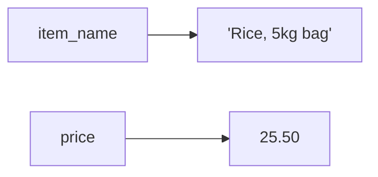
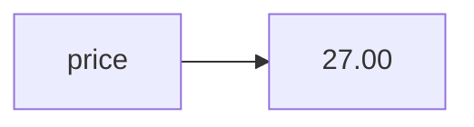

# Values and Variables

*`00-foundations/01-programming/concepts/01-values-and-variables.md`, part of [Unslop](https://github.com/sage9705/unslop)*

> **Fundamental**

## Learn the Syntax

This doc explains the idea of values and variables, not Python's exact syntax rules. If you feel lost on the "how do I actually type this" side, these fill that gap:

- **[W3Schools: Python Variables](https://www.w3schools.com/python/python_variables.asp)**, quick, interactive, good for a first pass
- **[Real Python: Variables in Python](https://realpython.com/python-variables/)**, a slower, more thorough walkthrough if W3Schools moves too fast
- **[Official docs: Assignment statements](https://docs.python.org/3/reference/simple_stmts.html#assignment-statements)**, the authoritative reference, worth a look once you want the precise rules

## The Question

How does a program keep track of information?

---

## Values

At its simplest, a program works with **values**, pieces of information.

```python
"Rice, 5kg bag"
25.50
True
```

Each of these is a value. A value doesn't need a name to exist. `25.50` is `25.50` whether or not anything refers to it.

---

## Variables

A **variable** gives a value a name, so you can refer to it later.

```python
item_name = "Rice, 5kg bag"
price = 25.50
in_stock = True
```

Think of a variable as a label pointing at a value:



The variable is the **name**. The value is the **information** it refers to. They are not the same thing.

---

## Where This Shows Up

Every point of sale system, every invoice, every bank statement starts with exactly this: naming a value so a program can act on it later. When a shop's till adds up a customer's order, it is reading variables like `price` and `quantity` for each item, one after another. Get the naming wrong, or lose track of a value partway through, and a real customer gets charged the wrong amount.

---

## Try It

```python
item_name = "Bread"
price = 12.00

print(item_name)
print(price)
```

Change the values, then predict the output before you run it again.

---

## Reassignment

Assignment changes what a variable refers to. It doesn't change the old value, it just points the name somewhere new.

```python
price = 25.50
price = 27.00
```

| Step         | `price` refers to |
| ------------ | ------------------- |
| After line 1 | `25.50`           |
| After line 2 | `27.00`           |



The `25.50` isn't "changed into" `27.00`. `price` simply points at a different value now, the same way a supplier raising their price doesn't retroactively change what you paid last week. It only changes what you'll pay next time.

---

## What You Need to Understand

- values
- variables
- assignment (`=`)
- reading a variable
- reassigning a variable


## Exercise

A supplier just delivered stock to a small shop. Without looking at the examples above, write a program that stores:

- the product name
- the unit price
- how many units arrived
- whether the item needs refrigeration

Print all four. Then the supplier calls to say they made a pricing error. Update the price variable and print it again, predicting the new output first.

> Write this one yourself, no AI. That's the Golden Rule, see the [section README](../README.md#the-golden-rule-zero-ai-code-generation).

---

## Checkpoint

Explain, in your own words:

1. What is a value?
2. What is a variable?
3. What does `=` do in Python?
4. What happens when a variable is assigned a new value?
5. Why would a real inventory system need to keep values like price and quantity separate, named, and easy to update?
