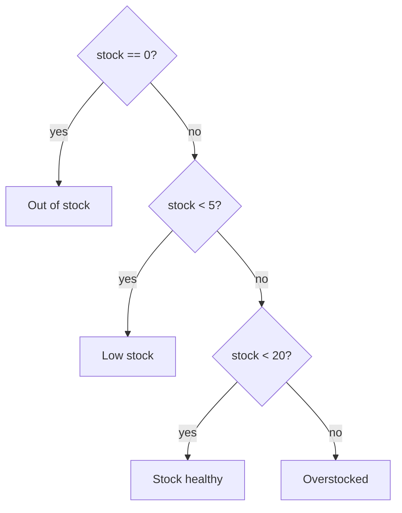

# Conditionals

*`00-foundations/01-programming/concepts/04-conditionals.md`, part of [Unslop](https://github.com/sage9705/unslop)*

> **Fundamental**

## Learn the Syntax

This doc explains how decisions are made in a program, not every shorthand Python offers for writing them. For that side:

- **[W3Schools: Python If...Else](https://www.w3schools.com/python/python_if_else.asp)**, short, example-driven, good for a first pass
- **[Real Python: Conditional Statements in Python](https://realpython.com/python-conditional-statements/)**, a fuller walkthrough of if, elif, else, and nesting
- **[Official docs: if Statements](https://docs.python.org/3/tutorial/controlflow.html#if-statements)**, the authoritative reference

## The Question

How does a program make a decision?

---

## The `if` Statement

An `if` statement runs a block of code only when a condition is `True`.

```python
stock_quantity = 4

if stock_quantity < 5:
    print("Reorder needed.")
```

If the condition is `False`, the indented block is simply skipped.

---

## `if` / `elif` / `else`

Most decisions have more than one path.

```python
stock_quantity = 4

if stock_quantity == 0:
    status = "Out of stock"
elif stock_quantity < 5:
    status = "Low stock, reorder soon"
elif stock_quantity < 20:
    status = "Stock healthy"
else:
    status = "Overstocked"
```

Python checks each condition in order and runs the **first** block that matches. If none match, `else` catches the rest.



---

## Where This Shows Up

This is close to the real logic behind low stock alerts in almost any inventory system, a shop's back office, a warehouse, even the "only 2 left" warning on an online store. A handful of `if` and `elif` checks like this one are what keep a real business from running out of a product nobody noticed was low.

---

## Truthy and Falsy Values

You don't always need an explicit comparison. Python treats some values as automatically `True` or `False` in a condition:

| Value                              | Treated as |
| ---------------------------------- | ---------- |
| `0`, `0.0`                     | `False`  |
| `""` (empty string)              | `False`  |
| `[]`, `{}` (empty collections) | `False`  |
| `None`                           | `False`  |
| anything else                      | `True`   |

```python
customer_note = ""

if customer_note:
    print(f"Note on file: {customer_note}")
else:
    print("No note for this order.")
```

This is convenient, but be intentional about it. `if stock_quantity:` reads differently than `if stock_quantity > 0:`, and the difference matters if a bug ever lets `stock_quantity` go negative. A naive `if stock_quantity:` would treat that negative number as truthy and miss the problem entirely.

---

## Nested Conditionals

Conditions can live inside other conditions:

```python
if stock_quantity > 0:
    if payment_confirmed:
        print("Order can ship.")
    else:
        print("Waiting on payment.")
else:
    print("Out of stock, cannot fulfil order.")
```

This works, but it gets hard to read quickly. Often the same logic reads more clearly with `and`:

```python
if stock_quantity > 0 and payment_confirmed:
    print("Order can ship.")
```

If you notice conditionals nesting three or four levels deep, that's usually a sign the logic wants to be broken into a function, more on that later.

---

## Try It

```python
stock_quantity = 12

if stock_quantity == 0:
    print("Out of stock")
elif stock_quantity < 5:
    print("Low stock")
elif stock_quantity < 20:
    print("Stock healthy")
else:
    print("Overstocked")
```

Change `stock_quantity` to a few different values and predict the output each time before running it.

---

## What You Need to Understand

- `if`, `elif`, `else`
- comparison and logical operators inside conditions
- truthy and falsy values
- when nesting is getting out of hand


## Exercise

A shop wants an automatic stock status for each product. Write a program that takes a stock quantity and a reorder threshold, then prints one of:

- "Out of stock" if quantity is 0
- "Reorder now" if quantity is at or below the threshold
- "Stock healthy" otherwise

Then test it against at least five different quantities, including 0 and a quantity exactly equal to the threshold.

> Write this one yourself, no AI. That's the Golden Rule, see the [section README](../README.md#the-golden-rule-zero-ai-code-generation).

---

## Checkpoint

Explain, in your own words:

1. What happens if none of the `elif` conditions match and there's no `else`?
2. What does it mean for a value to be "falsy", and why is that risky for something like a stock quantity?
3. Why might deeply nested `if` statements be a problem?
4. How would you rewrite two nested `if` statements using `and`?
