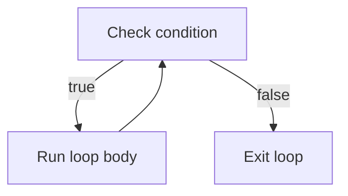

# Loops

*`00-foundations/01-programming/concepts/05-loops.md`, part of [Unslop](https://github.com/sage9705/unslop)*

> **Fundamental**

## Learn the Syntax

This doc explains why and when to repeat something. For more on syntax:

* **[W3Schools: For Loops](https://www.w3schools.com/python/python_for_loops.asp)** and  **[While Loops](https://www.w3schools.com/python/python_while_loops.asp)** , short and example driven, good for a first pass
* **[Real Python: Python for Loops](https://realpython.com/python-for-loop/)** and  **[Python while Loops](https://realpython.com/python-while-loop/)** , deeper walkthroughs with more edge cases
* **[Official docs: for Statements](https://docs.python.org/3/tutorial/controlflow.html#for-statements)** and  **[the while Statement](https://docs.python.org/3/reference/compound_stmts.html#the-while-statement)** , the authoritative reference

## The Question

How does a program repeat an action without repeating the code?

---

## `for` Loops

A `for` loop runs a block of code once for each item in a sequence.

```python
for day in range(7):
    print(day)
```

This prints `0` through `6`, one number for each day of a week's sales.

You can also loop directly over a [collection](07-collections.md), such as a list:

```python
products = ["Rice bag", "Cooking oil", "Sugar"]

for product in products:
    print(product)
```

Each pass through the loop, `product` refers to the next item in the list, the same way a shop clerk goes down a shelf checking one item after another. See the [collections lesson](07-collections.md) for how lists store, access, and change values.

---

## `while` Loops

A `while` loop repeats as long as a condition stays `True`.

```python
till_open = True
sales_count = 0

while till_open:
    sales_count = sales_count + 1
    if sales_count == 5:
        till_open = False
```

Use `for` when you know what you're iterating over, a product list, a week of sales. Use `while` when you're repeating until some condition changes, closing time, running out of stock. You don't know in advance how many times that will take.

---

## How a Loop Runs



Every loop, no matter how it's written, follows this same shape: check, run, check again, until the condition is no longer true.

---

## `break` and `continue`

`break` exits a loop immediately.

```python
for quantity in [12, 8, 3, 15]:
    if quantity < 5:
        print("Found a low stock item, stopping scan.")
        break
```

`continue` skips the rest of the current pass and moves to the next one.

```python
for quantity in [12, 0, 8, 0, 3]:
    if quantity == 0:
        continue
    print(f"{quantity} units in stock")
```

---

## Common Loop Patterns

Most loops you'll write fit one of a handful of shapes:

| Pattern                | What It Does                            | Example                                          |
| ---------------------- | --------------------------------------- | ------------------------------------------------ |
| **Counting**     | Track how many times something happens  | Counting how many items are out of stock         |
| **Accumulating** | Build up a total                        | Summing a week's daily sales into a total        |
| **Searching**    | Look for something, stop when found     | Scanning inventory for the first low stock item  |
| **Building**     | Create a new collection from an old one | Building a list of products that need reordering |

```python
# accumulating a week's sales
daily_sales = [420, 380, 510, 290, 600, 710, 340]
weekly_total = 0

for amount in daily_sales:
    weekly_total = weekly_total + amount

print(weekly_total)
```

---

## Where This Shows Up

Loops are how real systems process anything at scale: a nightly job that emails every customer who hasn't paid, a report that sums every sale from the day, a script that checks every product in a warehouse for expiry. The moment a business has more than a handful of records, nobody handles them one by one by hand. A loop does it instead, every time, without getting tired or making a typo on record 4,000.

---

## Avoiding Infinite Loops

A `while` loop only stops when its condition becomes `False`. If nothing inside the loop ever changes that condition, it runs forever, the programming equivalent of a till that never closes.

```python
sales_count = 0

while sales_count < 5:
    print(sales_count)
    # forgot to update sales_count, this never stops
```

Whenever you write a `while` loop, check: what changes each time through the loop, and does it eventually make the condition false? If you can't answer that, you've likely written an infinite loop.

---

## Try It

```python
daily_sales = [420, 380, 510, 290, 600]
total = 0

for amount in daily_sales:
    total = total + amount

print(total)
print(total / len(daily_sales))
```

Before running it, predict what will print for both the total and the average.

---

## What You Need to Understand

- `for` loops over ranges and collections
- `while` loops and their exit condition
- `break` and `continue`
- the four common loop patterns
- how to spot a potential infinite loop

## Exercise

A shop tracks stock quantities for its products. Write a program that:

1. Loops through a list of [`(product_name, quantity)` pairs](07-collections.md#tuples).
2. Prints `"REORDER: {product_name}"` for anything at or below a threshold of 5.
3. Counts and prints how many products need reordering in total.

> Write this one yourself, no AI. That's the Golden Rule, see the [section README](../README.md#the-golden-rule-zero-ai-code-generation).

---

## Checkpoint

Explain, in your own words:

1. When would you choose a `while` loop over a `for` loop?
2. What's the difference between `break` and `continue`?
3. What causes an infinite loop, and how would you catch one before running the code?
4. Which loop pattern, counting, accumulating, searching, or building, does the stock reorder exercise use?

This is also a good moment to look at `problem-solving/04-tracing-programs.md`, loops are where mentally tracing a program starts to really matter.
