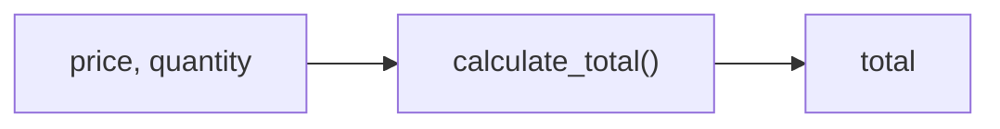

# Functions

*`00-foundations/01-programming/concepts/06-functions.md`, part of [Unslop](https://github.com/sage9705/unslop)*

> **Fundamental**

## Learn the Syntax

This lesson focuses on why functions matter and how to use them well in practice. It is not a complete reference for every possible way Python can define one. For that side:

- **[W3Schools: Python Functions](https://www.w3schools.com/python/python_functions.asp)**, short, example driven, good for a first pass
- **[Real Python: Defining Your Own Python Function](https://realpython.com/defining-your-own-python-function/)**, a fuller walkthrough of parameters, arguments, and return values
- **[Official docs: Defining Functions](https://docs.python.org/3/tutorial/controlflow.html#defining-functions)**, the authoritative reference

## The Question

How do you package a piece of logic so you can reuse it without retyping it every time?

---

## Defining a Function

A function is a named, reusable block of code. You define it once with `def`, then call it as many times as you need.

```python
def calculate_total(price, quantity):
    return price * quantity
```

`price` and `quantity` are **parameters**, placeholders for values the function will receive. `return` sends a value back to whoever called the function.

## Calling a Function

Defining a function doesn't run it. Calling it does.

```python
total = calculate_total(25.50, 3)
print(total)   # 76.5
```

Here, `25.50` and `3` are the **arguments**, the actual values plugged into `price` and `quantity` for this particular call. The same function can be called with completely different numbers, for a completely different order, without changing a single line of the function itself.

---

## Parameters With Default Values

A default value gives a parameter a fallback value when the caller does not pass one in. This is useful when most calls should behave the same way, but you still want to allow an override when needed.

```python
def calculate_total(price, quantity, discount_percent=0):
    subtotal = price * quantity
    discount = subtotal * (discount_percent / 100)
    return subtotal - discount
```

Here, `discount_percent` has a default of `0`, meaning no discount is applied unless the caller provides a different value.

```python
calculate_total(25.50, 3)          # no discount, uses the default
calculate_total(25.50, 3, 10)      # 10% discount applied
```

Default parameters make functions easier to call because they reduce repetition. The caller can pass a value only when it matters, and otherwise the function still works with a sensible standard behavior.

---

## Return vs Print

A function that `return`s a value hands that value back so it can be used in further calculations. A function that only `print`s a value just displays it and gives nothing back.

```python
def show_total(price, quantity):
    print(price * quantity)   # displays a number, returns nothing usable

def get_total(price, quantity):
    return price * quantity   # hands back a number you can store, compare, or reuse
```

If you ever try to do `result = show_total(10, 2)` and then use `result` in a calculation, you'll get `None`, because `show_total` never returned anything. This mistake is common enough that it's worth internalizing early: printing is for people, returning is for the rest of your program.

---

## Functions Calling Functions

Once you have a few small functions, you can build bigger behavior by having one function call another.

```python
def calculate_subtotal(price, quantity):
    return price * quantity

def apply_tax(subtotal, tax_rate):
    return subtotal + subtotal * tax_rate

def calculate_total(price, quantity, tax_rate):
    subtotal = calculate_subtotal(price, quantity)
    return apply_tax(subtotal, tax_rate)
```

Each function does one small thing well. `calculate_total` doesn't need to know how tax is calculated, it just trusts `apply_tax` to handle that part. This is decomposition in code form, the same skill from `problem-solving/02-decomposition.md`, now expressed as actual functions instead of a diagram on paper.

---

## Where This Shows Up

Every button in a real point of sale system, "apply discount", "calculate total", "print receipt", is a function call under the hood. The person who built the discount logic doesn't need to also understand how the receipt printer works, and vice versa. Functions are what let a shop's software be built, tested, and fixed by different people working on different pieces without anyone needing to hold the entire program in their head at once.



---

## Try It

```python
def calculate_change(cash_given, total_due):
    return cash_given - total_due

change = calculate_change(50, 37.25)
print(change)
```

Predict the output before running it. Then call the function again with different numbers and predict again.

---

## What You Need to Understand

- defining a function with `def`
- parameters versus arguments
- `return` versus `print`
- default parameter values
- calling one function from inside another

---

## Exercise

Build the core of the Till Calculator project. Write a function `calculate_total(price, quantity, discount_percent=0, tax_rate=0.125)` that:

1. Calculates the subtotal.
2. Applies the discount, if any.
3. Adds tax on top of the discounted amount.
4. Returns the final total.

Call it with at least three different combinations of arguments, including one that uses the default discount, and predict each result before running it.

> Write this one yourself, no AI. That's the Golden Rule, see the [section README](../README.md#the-golden-rule-zero-ai-code-generation).

---

## Checkpoint

Explain, in your own words:

1. What is the difference between a parameter and an argument?
2. What happens when you use a function's return value without the function actually returning anything?
3. Why does splitting `calculate_total` into smaller functions like `calculate_subtotal` and `apply_tax` make the code easier to fix later?
4. When would you give a parameter a default value?
