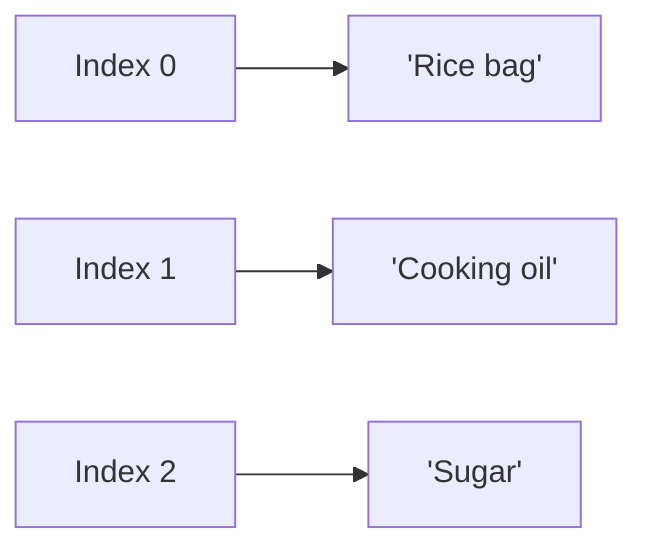

# Collections

*`00-foundations/01-programming/concepts/07-collections.md`, part of [Unslop](https://github.com/sage9705/unslop)*

> **Fundamental**

## Learn the Syntax

This doc explains why lists and tuples exist and when to reach for each, not every method Python attaches to them. For that side:

- **[W3Schools: Python Lists](https://www.w3schools.com/python/python_lists.asp)**, short, example driven, good for a first pass
- **[Real Python: Lists and Tuples in Python](https://realpython.com/python-lists-tuples/)**, a fuller comparison of the two
- **[Official docs: Data Structures](https://docs.python.org/3/tutorial/datastructures.html)**, the authoritative reference, including the full list of list methods

## The Question

How do you store many related values together, in order, so you can work with them as a group?

---

## Lists

A list holds an ordered collection of values, and you can add to it, remove from it, and change it as your program runs.

```python
products = ["Rice bag", "Cooking oil", "Sugar"]
```

Each item has a position, called an **index**, starting at `0`.

```python
products[0]   # "Rice bag"
products[1]   # "Cooking oil"
products[2]   # "Sugar"
```

## Changing a List

```python
products.append("Flour")          # add a new item to the end
products.remove("Sugar")          # remove a specific item
products[0] = "Rice bag, 10kg"     # change an item by index
print(len(products))              # how many items are left
```

Lists are **mutable**, meaning they can be changed after they're created, without you having to build a brand new list from scratch every time stock changes.

---

## Tuples

A tuple looks similar to a list, but once created, it can't be changed. Use parentheses instead of square brackets.

```python
receipt_line = ("Rice bag", 25.50, 3)
```

```python
receipt_line[1]      # 25.50
receipt_line[1] = 30 # raises an error, tuples can't be modified
```

## Choosing Between the Two

| Use a list when                                      | Use a tuple when                                                                                     |
| ---------------------------------------------------- | ---------------------------------------------------------------------------------------------------- |
| The data changes over time, like a shop's stock list | The data represents a fixed record that shouldn't change once created, like a completed receipt line |
| You need to add or remove items                      | You just need to pass a fixed group of values around                                                 |
| Order matters and the collection grows or shrinks    | The number of values is fixed and known upfront                                                      |

A shop's inventory list is a natural fit for a list, items get added and removed all the time. A single sale, once it's rung up and printed, is a natural fit for a tuple, `(item_name, price, quantity)` shouldn't change after the customer has already paid and left.

---

## Looping Through a Collection

This is where lists and loops meet directly.

```python
for product in products:
    print(product)
```

Every item gets visited once, in order, exactly as covered in `05-loops.md`.

---

## Where This Shows Up

Every shopping cart, every inventory list, every batch of records pulled from a database is a list under the hood, an ordered group of values you can loop through, filter, and modify. A completed order confirmation, on the other hand, behaves like a tuple: once it's issued, changing it after the fact would mean the customer paid for one thing and got a record of another.



---

## Try It

```python
daily_sales = [420, 380, 510]
daily_sales.append(290)

print(daily_sales)
print(len(daily_sales))
print(daily_sales[0])
```

Predict each line's output before running it.

---

## What You Need to Understand

- creating and indexing a list
- adding, removing, and changing items in a list
- what makes a list mutable
- creating a tuple and why it can't be changed
- when to choose a list versus a tuple
- looping through a collection

---

## Exercise

A shop needs to track its product list for the day. Write a program that:

1. Starts with a list of five product names already in stock.
2. Adds a new product that just arrived.
3. Removes a product that's been discontinued.
4. Prints the final list and how many products are on it.

Then create a tuple representing one completed sale, `(item_name, price, quantity)`, and try to change one of its values to confirm it raises an error.

> Write this one yourself, no AI. That's the Golden Rule, see the [section README](../README.md#the-golden-rule-zero-ai-code-generation).

---

## Checkpoint

Explain, in your own words:

1. What does it mean for a list to be mutable?
2. Why would a completed sale record be a better fit for a tuple than a list?
3. What happens if you try to change a value inside a tuple?
4. Why does a shop's live inventory need a data structure that can grow and shrink?
