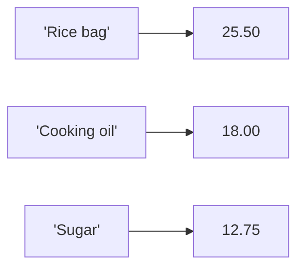

# Dictionaries and Sets

*`00-foundations/01-programming/concepts/08-dictionaries-and-sets.md`, part of [Unslop](https://github.com/sage9705/unslop)*

> **Fundamental**

## Learn the Syntax

This doc explains why looking things up by key matters and when uniqueness matters, not every method attached to these types. For that side:

- **[W3Schools: Python Dictionaries](https://www.w3schools.com/python/python_dictionaries.asp)** and **[Python Sets](https://www.w3schools.com/python/python_sets.asp)**, short, example driven, good for a first pass
- **[Real Python: Dictionaries in Python](https://realpython.com/python-dicts/)** and **[Sets in Python](https://realpython.com/python-sets/)**, fuller walkthroughs of each
- **[Official docs: Dictionaries](https://docs.python.org/3/tutorial/datastructures.html#dictionaries)** and **[Sets](https://docs.python.org/3/tutorial/datastructures.html#sets)**, the authoritative reference

## The Question

How do you look something up by name instead of by position?

---

## Dictionaries

A list finds things by index, `products[0]`. A dictionary finds things by a meaningful **key** instead, which is often more natural for real data.

```python
catalog = {
    "Rice bag": 25.50,
    "Cooking oil": 18.00,
    "Sugar": 12.75,
}
```

```python
catalog["Rice bag"]   # 25.50
```

## Changing a Dictionary

```python
catalog["Flour"] = 15.00          # add a new entry
catalog["Sugar"] = 13.25          # update an existing price
del catalog["Cooking oil"]        # remove an entry
```

## Looking Up Safely

Accessing a key that doesn't exist raises an error:

```python
catalog["Butter"]   # raises KeyError, "Butter" isn't in the catalog
```

`.get()` lets you look something up without crashing if it's missing:

```python
price = catalog.get("Butter", 0)   # returns 0 instead of raising an error
```

This matters the moment real data gets involved, a cashier scanning a barcode that isn't in the catalog yet shouldn't crash the whole till.

## Checking Before You Look

```python
if "Rice bag" in catalog:
    print("In stock catalog")
```

## Nested Dictionaries

A dictionary's values can themselves be dictionaries, useful for storing more than one fact about the same key.

```python
inventory = {
    "Rice bag": {"price": 25.50, "quantity": 40},
    "Sugar": {"price": 12.75, "quantity": 8},
}

inventory["Sugar"]["quantity"]   # 8
```

---

## Sets

A set stores unique values with no fixed order, and no duplicates allowed.

```python
customers_today = set()

customers_today.add("0551234567")
customers_today.add("0209876543")
customers_today.add("0551234567")   # duplicate, ignored

print(len(customers_today))   # 2, not 3
```

Sets are the natural fit whenever "how many distinct things happened" matters more than "in what order did they happen."

```python
if "0551234567" in customers_today:
    print("Returning customer today")
```

---

## Where This Shows Up

Any real system that looks something up by ID, a product SKU, a customer account, an order number, is built on exactly the dictionary pattern: key in, value out. Any real system that needs to avoid counting the same thing twice, unique visitors to a shop in a day, unique products sold this week, reaches for a set. A shop's catalog is a dictionary. The list of distinct customers who walked in today is a set.



---

## Try It

```python
catalog = {"Rice bag": 25.50, "Sugar": 12.75}

price = catalog.get("Cooking oil", 0)
print(price)

catalog["Cooking oil"] = 18.00
print(catalog.get("Cooking oil", 0))
```

Predict each `print()` output before running it.

---

## What You Need to Understand

- creating and accessing a dictionary by key
- adding, updating, and removing entries
- looking up safely with `.get()` instead of risking a `KeyError`
- checking whether a key exists with `in`
- creating a set and why duplicates disappear
- when a dictionary is the right tool versus when a set is

---

## Exercise

Build the price lookup for the Till Calculator project. Write a program that:

1. Creates a small product catalog dictionary with at least four items and their prices.
2. Looks up the price of an item that exists, and one that doesn't, using `.get()` with a default of `0`.
3. Updates the price of one item.
4. Builds a set of customer phone numbers from a list that contains at least one duplicate, and prints how many distinct customers that actually represents.

> Write this one yourself, no AI. That's the Golden Rule, see the [section README](../README.md#the-golden-rule-zero-ai-code-generation).

---

## Checkpoint

Explain, in your own words:

1. What's the difference between looking something up in a list and looking something up in a dictionary?
2. Why is `.get()` often safer than `catalog["some key"]` directly?
3. What happens when you add a value to a set that's already in it?
4. Why would a shop use a dictionary for its catalog but a set for tracking unique daily customers?
