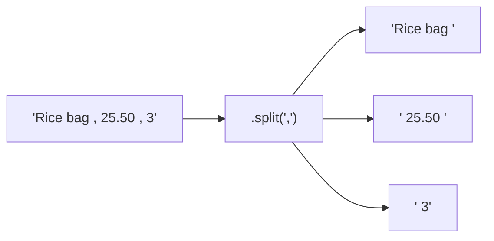

# Strings

*`00-foundations/01-programming/concepts/09-strings.md`, part of [Unslop](https://github.com/sage9705/unslop)*

> **Fundamental**

## Learn the Syntax

This doc explains why text needs its own handling, not every string method Python ships with. For that side:

- **[W3Schools: Python Strings](https://www.w3schools.com/python/python_strings.asp)**, short, example driven, good for a first pass
- **[Real Python: Strings and Character Data in Python](https://realpython.com/python-strings/)**, a fuller walkthrough covering slicing, formatting, and methods
- **[Official docs: Text Sequence Type str](https://docs.python.org/3/library/stdtypes.html#text-sequence-type-str)**, the authoritative reference

## The Question

How does a program work with text?

---

## String Basics

A string is text, wrapped in quotes. You can join strings together with `+`, and build formatted output with an f-string.

```python
item_name = "Rice bag"
quantity = 3

message = "Order: " + item_name
print(message)

message = f"Order: {item_name}, quantity {quantity}"
print(message)
```

f-strings, the `f` right before the opening quote, let you drop variables straight into text without manually gluing pieces together with `+`.

---

## Common String Operations

| Operation                   | What It Does                           | Example                                   |
| --------------------------- | -------------------------------------- | ----------------------------------------- |
| `len(text)`               | length of the string                   | `len("Rice bag")` returns `8`         |
| `.lower()` / `.upper()` | change case                            | `"Rice".lower()` returns `"rice"`     |
| `.strip()`                | remove leading and trailing whitespace | `"  Rice  ".strip()` returns `"Rice"` |
| `.replace(old, new)`      | swap one piece of text for another     | `"Rice bag".replace("bag", "sack")`     |
| `.split(separator)`       | break text into a list of pieces       | `"Rice,25.50,3".split(",")`             |
| indexing and slicing        | grab characters by position            | `"Rice bag"[0:4]` returns `"Rice"`    |

---

## Parsing Messy Input

Real input rarely arrives clean. A raw order line from a form or a spreadsheet often looks like this:

```python
raw_line = " Rice bag , 25.50 , 3 "

parts = raw_line.split(",")
item_name = parts[0].strip()
price = float(parts[1].strip())
quantity = int(parts[2].strip())

print(item_name, price, quantity)
```

Notice the `.strip()` calls. Without them, `item_name` would be `" Rice bag "` with extra spaces still attached, which looks fine when printed but silently fails an exact comparison like `item_name == "Rice bag"` later in the program.

---

## Formatting Output

f-strings also let you control how numbers are displayed, useful for anything involving money.

```python
price = 25.5
print(f"Price: {price:.2f}")   # price: 25.50
```

`:.2f` means "format this as a decimal number with exactly two digits after the point," which matters when you're printing something a customer is meant to read as an exact amount.

---

## Where This Shows Up

Every CSV import, every form submission, every line typed by a cashier arrives as a string first, before it's anything else. A shop's till doesn't receive a clean `25.50` float from a customer, it receives whatever text was typed, and has to split it, strip it, and convert it before trusting it. Getting string handling wrong is exactly how a stray space or a mismatched case turns into a real bug that only shows up with real customer data.



---

## Try It

```python
raw = "  Sugar , 12.75 , 4  "
parts = raw.split(",")

name = parts[0].strip()
price = float(parts[1].strip())
quantity = int(parts[2].strip())

print(f"{name}: {price:.2f} x {quantity}")
```

Predict the printed line before running it.

---

## What You Need to Understand

- building strings with `+` and with f-strings
- common string operations: `len()`, `.lower()`, `.upper()`, `.strip()`, `.replace()`, `.split()`
- indexing and slicing a string
- why `.strip()` matters for real, messy input
- formatting numbers inside an f-string

---

## Exercise

A supplier sends stock updates as raw text lines like `"Cooking oil, 18.00, 25"`. Write a program that:

1. Splits the line into item name, price, and quantity.
2. Strips whitespace from each part.
3. Converts price and quantity to the correct types.
4. Prints a clean, formatted line: item name, price to two decimal places, and quantity.

Then test it with a messier line that has extra spaces in different places, and confirm your program still parses it correctly.

> Write this one yourself, no AI. That's the Golden Rule, see the [section README](../README.md#the-golden-rule-zero-ai-code-generation).

---

## Checkpoint

Explain, in your own words:

1. What's the difference between joining strings with `+` and using an f-string?
2. Why does `.strip()` matter when parsing real input?
3. What does `.split(",")` return, and what type is it?
4. Why would `"Rice bag "` (with a trailing space) fail to match `"Rice bag"` in a comparison, even though they look identical when printed?
