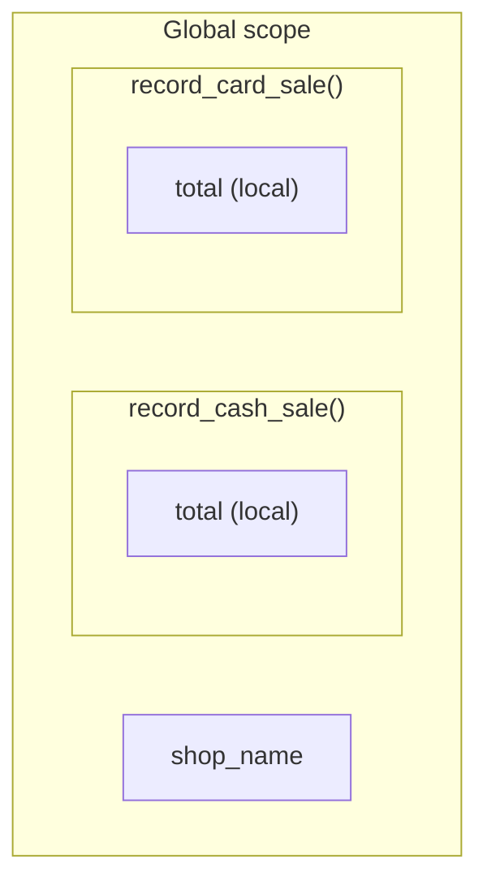

# Scope

*`00-foundations/01-programming/concepts/10-scope.md`, part of [Unslop](https://github.com/sage9705/unslop)*

> **Understand**

## Learn the Syntax

This doc explains which parts of a program can see a given variable, not every edge case of Python's scoping rules. For that side:

- **[W3Schools: Python Scope](https://www.w3schools.com/python/python_scope.asp)**, short, example driven, good for a first pass
- **[Real Python: Python Scope and the LEGB Rule](https://realpython.com/python-scope-legb-rule/)**, a fuller walkthrough of local, enclosing, global, and built-in scope
- **[Official docs: Python Scopes and Namespaces](https://docs.python.org/3/tutorial/classes.html#python-scopes-and-namespaces)**, the authoritative reference

## The Question

Which parts of a program can see and use a given variable?

---

## Local Scope

A variable created inside a function only exists inside that function. Once the function finishes running, that variable is gone.

```python
def calculate_total(price, quantity):
    subtotal = price * quantity   # local to this function
    return subtotal

calculate_total(25.50, 3)
print(subtotal)   # raises NameError, subtotal doesn't exist out here
```

`subtotal` is a **local variable**. It's created fresh every time the function runs, and it disappears the moment the function returns.

## Global Scope

A variable created at the top level of a program, outside any function, is a **global variable**. It's visible everywhere in that file, including inside functions, as long as you're only reading it.

```python
shop_name = "Corner Shop"

def print_receipt_header():
    print(f"Receipt from {shop_name}")   # reads the global fine

print_receipt_header()
```

## The Trap

Reading a global variable from inside a function works fine. Trying to change it without saying so does not do what you'd expect.

```python
total_sales = 0

def record_sale(amount):
    total_sales = total_sales + amount   # this creates a NEW local variable, doesn't touch the global one
    return total_sales

record_sale(50)
print(total_sales)   # still 0, the global was never actually changed
```

Python assumes that assigning to a name inside a function creates a local variable, unless you explicitly say `global total_sales` first. Most of the time, though, the better fix isn't the `global` keyword. It's to avoid reaching into global state from inside a function at all: pass the value in as a parameter, and return the updated value out.

```python
def record_sale(current_total, amount):
    return current_total + amount

total_sales = record_sale(total_sales, 50)
print(total_sales)   # 50, this time it actually updates
```

---

## Where This Shows Up

In any real system with more than one file and more than one developer, scope is what stops one part of the code from silently overwriting another part's data. A shop's till program might have a function that calculates a daily `total` for cash sales, and a completely separate function that calculates a `total` for card sales. Because each `total` is local to its own function, they never collide, even though they share a name.



---

## Try It

```python
def calculate_cash_total(sales):
    total = 0
    for amount in sales:
        total = total + amount
    return total

def calculate_card_total(sales):
    total = 0
    for amount in sales:
        total = total + amount
    return total

cash = calculate_cash_total([100, 200])
card = calculate_card_total([50, 75])

print(cash)
print(card)
```

Both functions use a local variable called `total`. Predict whether they interfere with each other before running this.

---

## What You Need to Understand

- what makes a variable local to a function
- what makes a variable global
- why reading a global from inside a function is fine, but assigning to it usually isn't what you expect
- why passing values in and returning them out is usually cleaner than reaching for `global`

---

## Exercise

Write two separate functions, `apply_shop_discount(total)` and `apply_loyalty_discount(total)`, each of which creates its own local variable called `discount` and returns a discounted total using a different percentage. Call both functions with the same starting total and confirm the two `discount` variables never interfere with each other.

Then write a small experiment that tries to read one function's local variable from outside of it, and observe the error.

> Write this one yourself, no AI. That's the Golden Rule, see the [section README](../README.md#the-golden-rule-zero-ai-code-generation).

---

## Checkpoint

Explain, in your own words:

1. What happens to a local variable once its function finishes running?
2. Why does assigning to a global variable inside a function without the `global` keyword not work the way you'd expect?
3. Why is passing a value in and returning it out usually a better fix than using `global`?
4. Why can two different functions safely use a variable with the same name, like `total`, without conflict?
