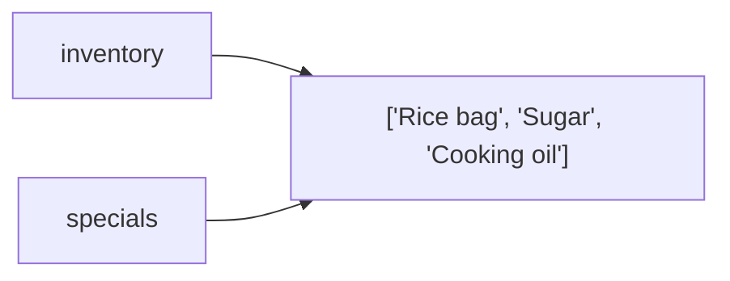
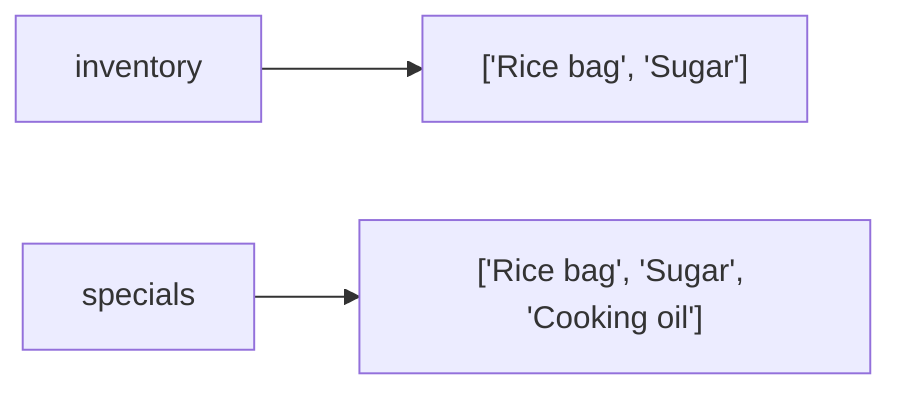

# Mutation and References

*`00-foundations/01-programming/concepts/11-mutation-and-references.md`, part of [Unslop](https://github.com/sage9705/unslop)*

> **Understand**

## Learn the Syntax

This doc explains why two variables can secretly share the same data, not every rule of Python's object model. For that side:

- **[W3Schools: Copy Lists](https://www.w3schools.com/python/python_lists_copy.asp)**, short, example driven, shows exactly this problem and its fix
- **[Real Python: Python's Mutable vs Immutable Types](https://realpython.com/python-mutable-vs-immutable-types/)**, a fuller explanation of why this happens
- **[Official docs: the copy module](https://docs.python.org/3/library/copy.html)**, the authoritative reference for copying data properly

## The Question

Can two variables end up sharing the exact same data, and what happens if one of them changes it?

---

## Assignment Doesn't Copy a List

This is one of the most common surprises for anyone new to programming.

```python
inventory = ["Rice bag", "Sugar"]
specials = inventory
```

You might expect `specials` to be a separate, independent list. It isn't. `specials` and `inventory` are two different names pointing at the exact same list in memory.

```python
specials.append("Cooking oil")

print(inventory)   # ["Rice bag", "Sugar", "Cooking oil"], it changed too
print(specials)    # ["Rice bag", "Sugar", "Cooking oil"]
```



Appending to `specials` changed `inventory` as well, because there was never two lists to begin with. There was always just one list with two names attached to it.

## Making an Actual Copy

If you want `specials` to be its own independent list, you have to say so explicitly.

```python
specials = inventory.copy()
# or: specials = list(inventory)
# or: specials = inventory[:]

specials.append("Cooking oil")

print(inventory)   # unchanged, ["Rice bag", "Sugar"]
print(specials)    # ["Rice bag", "Sugar", "Cooking oil"]
```



Now there are genuinely two separate lists, and changing one has no effect on the other.

## Why Immutable Types Don't Have This Problem

Numbers, strings, and tuples are **immutable**, they can't be changed in place at all. So even though assignment still just copies a name, not the value, there's nothing to accidentally mutate.

```python
price = 25.50
new_price = price
new_price = new_price + 5   # this creates a brand new number, doesn't touch price

print(price)       # still 25.50
print(new_price)   # 30.50
```

This is why the sharing bug only shows up with mutable types like lists and dictionaries, never with plain numbers or strings.

---

## Where This Shows Up

This exact bug, two parts of a program unknowingly sharing the same list, is one of the most common real sources of data corruption once a program grows past a single file. A function meant to build a temporary "today's specials" list from the main inventory can silently corrupt the real inventory, simply because nobody copied the list before handing it off. This becomes especially easy to trip over once you start passing lists and dictionaries into functions, which behave exactly the same way arguments do.

---

## Try It

```python
main_menu = ["Rice bag", "Sugar", "Cooking oil"]
weekend_special = main_menu

weekend_special.append("Discounted flour")

print(main_menu)
```

Predict the output before running it. Then fix it using `.copy()` and predict again.

---

## What You Need to Understand

- why assigning a list to a new variable doesn't create a new list
- how to make an actual independent copy
- why this problem only affects mutable types like lists and dictionaries
- why this matters more once lists get passed into functions

---

## Exercise

A shop wants to build a "clearance items" list based on its main inventory, without affecting the main inventory itself. Write a program that:

1. Creates a main inventory list of five products.
2. Attempts to build a clearance list using plain assignment, adds an item to it, and prints the main inventory to show the bug.
3. Fixes it using `.copy()`, adds an item to the clearance list, and prints the main inventory again to confirm it's now unaffected.

> Write this one yourself, no AI. That's the Golden Rule, see the [section README](../README.md#the-golden-rule-zero-ai-code-generation).

---

## Checkpoint

Explain, in your own words:

1. What actually happens when you write `specials = inventory`?
2. Why does appending to `specials` also change `inventory` in that case?
3. Why doesn't this problem happen with numbers or strings?
4. Name one real situation where this bug could quietly corrupt a shop's data.
