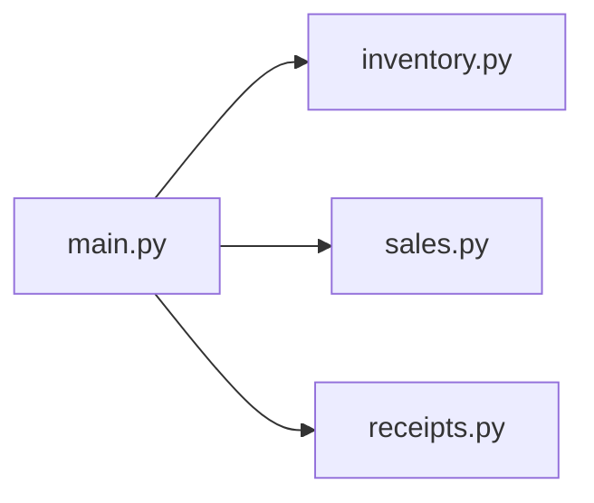

# Modules

*`00-foundations/01-programming/concepts/12-modules.md`, part of [Unslop](https://github.com/sage9705/unslop)*

> **Fundamental**

## Learn the Syntax

This doc explains why and when to split code across files, not every detail of Python's import system. For that side:

- **[W3Schools: Python Modules](https://www.w3schools.com/python/python_modules.asp)**, short, example driven, good for a first pass
- **[Real Python: Python Modules and Packages](https://realpython.com/python-modules-packages/)**, a fuller walkthrough of modules and packages
- **[Official docs: Modules](https://docs.python.org/3/tutorial/modules.html)**, the authoritative reference

## The Question

How do you keep a growing program from turning into one giant, unmanageable file?

---

## A Module Is Just a File

Any Python file is a module. You can write functions in one file and use them from another with `import`.

`inventory.py`:
```python
def add_stock(catalog, item_name, quantity):
    catalog[item_name] = catalog.get(item_name, 0) + quantity
    return catalog
```

`main.py`:
```python
import inventory

catalog = {}
catalog = inventory.add_stock(catalog, "Rice bag", 40)
print(catalog)
```

`inventory.add_stock(...)` calls the function defined in `inventory.py`, using the module name as a prefix.

## Importing Specific Names

If you only need one or two things from a module, you can import them directly instead of the whole module.

```python
from inventory import add_stock

catalog = add_stock({}, "Sugar", 20)
```

## Why Splitting Matters

A shop's program starts small, maybe one file that handles the till. But it soon grows to include inventory tracking, sales reporting, and receipt formatting. Keeping all of that in a single file makes it hard to find anything, and hard for more than one person to work on it at once.

```text
shop_system/
    main.py
    inventory.py
    sales.py
    receipts.py
```

Each file takes responsibility for one part of the problem, `inventory.py` only deals with stock, `sales.py` only deals with recording sales, `receipts.py` only deals with formatting output. This is the same decomposition skill from `problem-solving/02-decomposition.md`, now showing up as the actual shape of your project folder.



---

## The Standard Library

Python ships with many modules already written for you, covering common needs so you don't have to build everything from scratch.

```python
import math
import datetime

print(math.sqrt(16))          # 4.0
print(datetime.date.today())  # today's date
```

You'll meet more of these as you need them. For now, just know that `import` works the same way whether the module is one you wrote or one that ships with Python.

---

## Where This Shows Up

Every real, non-trivial codebase is broken into modules and packages by responsibility, exactly the way a shop's inventory, sales, and receipt logic get split apart here. This is precisely the shape you'll see again once Phase 1 backend work introduces separate files for routes, database models, and authentication, the same idea, just applied to a bigger system.

---

## Try It

`calculator.py`:
```python
def calculate_total(price, quantity):
    return price * quantity
```

`main.py`:
```python
from calculator import calculate_total

total = calculate_total(25.50, 4)
print(total)
```

Create both files, run `main.py`, and confirm it prints the right total.

---

## What You Need to Understand

- that any Python file is a module
- `import module_name` versus `from module_name import specific_thing`
- why splitting a growing program into separate files by responsibility helps
- that Python's standard library gives you modules you don't have to write yourself

---

## Exercise

Take the Till Calculator function you wrote in `06-functions.md` and split your program into two files:

1. `calculator.py`, containing the `calculate_total` function.
2. `main.py`, which imports and calls it with at least two different orders.

Run `main.py` and confirm both orders calculate correctly.

> Write this one yourself, no AI. That's the Golden Rule, see the [section README](../README.md#the-golden-rule-zero-ai-code-generation).

---

## Checkpoint

Explain, in your own words:

1. What is a module?
2. What's the difference between `import inventory` and `from inventory import add_stock`?
3. Why would a growing shop program benefit from being split into `inventory.py`, `sales.py`, and `receipts.py` instead of one big file?
4. Name one module from Python's standard library and what it's useful for.
