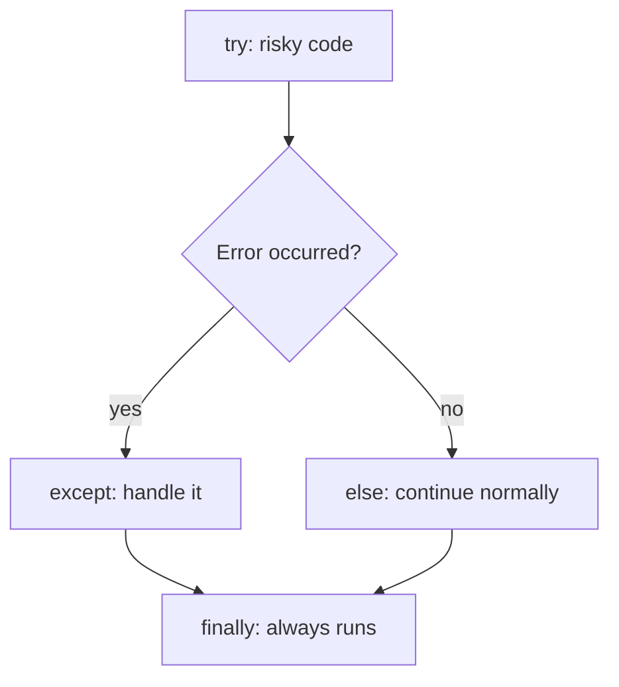

# Errors and Exceptions

*`00-foundations/01-programming/concepts/13-errors-and-exceptions.md`, part of [Unslop](https://github.com/sage9705/unslop)*

> **Fundamental**

## Learn the Syntax

This doc explains why programs need to handle failure gracefully, not every exception type Python defines. For that side:

- **[W3Schools: Python Try Except](https://www.w3schools.com/python/python_try_except.asp)**, short, example driven, good for a first pass
- **[Real Python: Python Exceptions, An Introduction](https://realpython.com/python-exceptions/)**, a fuller walkthrough of try, except, else, and finally
- **[Official docs: Errors and Exceptions](https://docs.python.org/3/tutorial/errors.html)**, the authoritative reference

## The Question

What happens when something goes wrong while a program is running, and how do you handle it without the whole thing crashing?

---

## Errors Happen

Real programs run into bad input constantly. A cashier mistypes a quantity. A product isn't in the catalog. A report tries to divide by zero because no sales happened yet today.

```python
int("four")            # ValueError, that text isn't a number
catalog["Butter"]      # KeyError, that key doesn't exist
10 / 0                 # ZeroDivisionError
```

Without handling, any one of these stops your entire program immediately.

---

## `try` and `except`

Wrap risky code in a `try` block, and handle the failure in an `except` block instead of letting the whole program crash.

```python
try:
    quantity = int(input("Enter quantity: "))
except ValueError:
    print("That's not a valid number. Sale cancelled.")
```

If the conversion succeeds, the `except` block is skipped entirely. If it fails, Python jumps straight to `except` instead of crashing.

## Catching the Right Exception

Naming the specific exception you expect, `ValueError`, `KeyError`, `ZeroDivisionError`, is far better than catching everything blindly.

```python
try:
    price = catalog[item_name]
except KeyError:
    print(f"'{item_name}' isn't in the catalog yet.")
```

A bare `except:` with no exception type catches everything, including mistakes you didn't anticipate, like a typo in your own code. That hides real bugs instead of surfacing them, which makes them far harder to find later.

## `else` and `finally`

```python
try:
    quantity = int(quantity_text)
except ValueError:
    print("Invalid quantity.")
else:
    print(f"Accepted quantity: {quantity}")   # runs only if no error occurred
finally:
    print("Done processing this line.")       # always runs, error or not
```

`else` runs only when the `try` block succeeds. `finally` always runs, whether there was an error or not, useful for cleanup steps you never want to skip.

---

## Where This Shows Up

A real point of sale system that crashes every time a cashier mistypes a number would be unusable within a single afternoon. Graceful error handling is exactly what separates a program that only works in a clean demo from one that survives real customers, real typos, and real edge cases like an item that's been discontinued mid-shift.



---

## Try It

```python
def safe_quantity(text):
    try:
        return int(text)
    except ValueError:
        print(f"'{text}' is not a valid quantity.")
        return None

print(safe_quantity("5"))
print(safe_quantity("five"))
```

Predict both outputs before running it.

---

## What You Need to Understand

- that unhandled errors stop the whole program
- `try` and `except`
- why catching a specific exception is better than a bare `except`
- what `else` and `finally` are each for

---

## Exercise

Write a function `safe_price_lookup(catalog, item_name)` that:

1. Tries to look up `item_name` in the catalog dictionary.
2. Catches `KeyError` and returns `None` with a printed message, instead of crashing, if the item isn't found.
3. Returns the price normally if the item is found.

Test it with an item that exists and one that doesn't, and confirm neither call crashes the program.

> Write this one yourself, no AI. That's the Golden Rule, see the [section README](../README.md#the-golden-rule-zero-ai-code-generation).

---

## Checkpoint

Explain, in your own words:

1. What happens to a program when an error isn't handled?
2. Why is catching a specific exception type better than a bare `except:`?
3. What's the difference between what `else` and `finally` each run for?
4. Why would a real point of sale system need to handle bad input without crashing?

This is also a good moment to look at the `debugging/` folder, error handling is what keeps a small mistake from taking down the whole program while you're still figuring out what went wrong.
