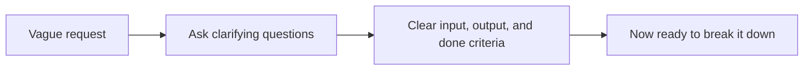

# Understanding the Problem

*`00-foundations/01-programming/problem-solving/01-understanding-the-problem.md`, part of [Unslop](https://github.com/sage9705/unslop)*

> **Core Skill**

## The Question

What do you actually need to know before you write a single line of code?

---

## Most Bad Code Isn't a Syntax Problem

A program can run without a single error and still be wrong, because it solves a problem that was never clearly understood in the first place. Confidently building the wrong thing is a far more common failure than writing broken syntax.

Here's a request a shop owner might actually give you:

> "I want to know if we're losing money on sales."

This sounds clear. It isn't. What does "losing money" mean here? Selling below what the item cost you? Selling below some target profit margin? Over what time period, today, this week, this month? For every product, or just a few that seem suspicious?

If you start writing code before answering these questions, you'll build something that runs, prints a number, and answers a question nobody actually asked.

---

## Turning a Vague Ask Into a Clear One

| Vague Ask | Clarifying Question |
|---|---|
| "Track our stock better" | Track what specifically, running low, expiring, or both? |
| "Tell me if we're losing money" | Losing money compared to what, cost price or target margin? |
| "See what customers think" | From reviews, complaints, both? Over what time period? |
| "Speed up checkout" | Speed for the cashier, or shorter lines for customers? |

Every vague request hides at least one of these underneath: unclear inputs, unclear output, or an unclear definition of "done."

---

## The Real Skill

Before touching a keyboard, write down, in plain language:

1. **What's the input?** What data do you actually have, or need to collect?
2. **What's the output?** What should the program produce, a number, a list, a message?
3. **What does "done" look like?** How would you check the answer is actually correct?

Applied to the loss report request:

- **Input:** a list of sales, each with a sale price and a cost price.
- **Output:** the total profit or loss, and a list of items sold below cost.
- **Done when:** the totals match a report you checked by hand against three or four sales.

Notice none of this involves Python yet. This is entirely about understanding the problem before deciding how to solve it.

---

## Where This Shows Up

In a real job, requirements almost never arrive as clean, unambiguous specifications. They arrive as a sentence from a manager, a message from a client, or an offhand comment from a shop owner walking past the till. The developers who ship the wrong thing usually didn't misunderstand Python, they misunderstood the actual problem, and nobody caught it until the feature was already built the wrong way. This is why understanding the problem always comes before decomposition, pseudocode, or code, in that order.

---

## Practice

Take this request: "Build something to help us track our stock."

Write down:

- What's the input, what data would this tool need?
- What's the output, what should it show?
- What would tell you the tool is actually done and working correctly?

---

## What You Need to Understand

- why a program can run correctly and still solve the wrong problem
- how to turn a vague request into concrete input, output, and done criteria
- why this step comes before decomposition, pseudocode, or any code at all

---

## Exercise

A shop owner gives you one of these requests:

- "Help me know when I'm about to run out of something important."
- "Tell me which products aren't selling well."

Pick one. Write a clear problem statement for it: the input, the output, and at least three clarifying questions you'd actually ask the shop owner before writing any code.

> Do this one yourself, no AI. That's the Golden Rule, see the [section README](../README.md#the-golden-rule-zero-ai-code-generation).

---

## Checkpoint

Explain, in your own words:

1. Why can a program be free of errors and still be wrong?
2. What three things should you know before writing code?
3. Why is "track our stock better" not yet a problem you can solve?
4. What's the risk of skipping this step and jumping straight to code?
