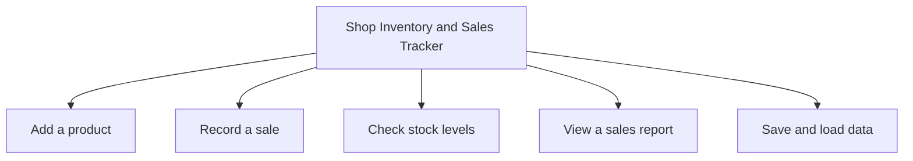
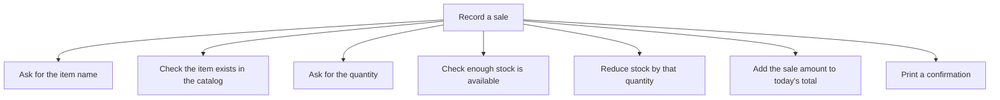

# Decomposition

*`00-foundations/01-programming/problem-solving/02-decomposition.md`, part of [Unslop](https://github.com/sage9705/unslop)*

> **Core Skill**

## The Question

How do you break a big, intimidating problem into pieces small enough to actually solve, one at a time?

---

## A Problem That's Too Big to Start

"Build a Shop Inventory and Sales Tracker" is not something you can sit down and write in one pass. It's too big to hold in your head all at once, and trying anyway is how projects stall before a single line of working code exists.

Decomposition means splitting that big problem into smaller, more manageable pieces before you write anything.

Each of those five pieces is still a real task, but it's a task you could realistically imagine finishing in an afternoon, which "build the whole tracker" never was.

---

## Decomposing Further

You don't stop at one level. Take "Record a sale" and break it down again.

Keep decomposing until each piece is small enough that you could reasonably write it as a single function, the kind covered in `concepts/06-functions.md`. "Check enough stock is available" is small enough. "Record a sale" on its own, before breaking it down, wasn't.

---

## Where This Shows Up

Real software teams plan almost exactly this way. An app idea gets broken into features. Features get broken into tickets. Tickets get broken into the individual functions and files a developer actually writes in a single sitting. The Shop Inventory and Sales Tracker project later in this folder is built piece by piece, in exactly this order, because trying to write the whole thing at once is how half-finished, tangled programs happen.

---

## Practice

Without writing any code, decompose "Build a Customer Feedback Analyzer" into its major pieces. Think about what the tool needs to do from start to finish, reading input, processing it, producing an output, and list each piece as a short phrase.

---

## What You Need to Understand

- why large problems need to be broken down before you start coding
- how to split a big task into smaller, independent pieces
- that you can decompose a piece more than once, until it's small enough to implement directly
- how decomposition connects to writing functions later

---

## Exercise

Take "Build a Stock Reorder Alert tool." Decompose it into at least four smaller pieces. Then take one of those pieces and decompose it one level further, the way "Record a sale" was broken down above.

> Do this one yourself, no AI. That's the Golden Rule, see the [section README](../README.md#the-golden-rule-zero-ai-code-generation).

---

## Checkpoint

Explain, in your own words:

1. Why is "build the whole tracker" a hard place to start?
2. What makes a decomposed piece "small enough"?
3. How does decomposition connect to the functions you'll eventually write?
4. Why might you decompose the same piece more than once?
