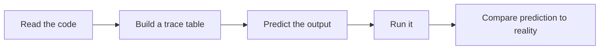

# Tracing Programs

*`00-foundations/01-programming/problem-solving/04-tracing-programs.md`, part of [Unslop](https://github.com/sage9705/unslop)*

> **Core Skill**

## The Question

How do you figure out what a program will do, without running it?

---

## A Simple Trace

```python
stock = 8
threshold = 5

if stock <= threshold:
    stock = stock + 10
    status = "Reordered"
else:
    status = "OK"

print(stock, status)
```

Before running this, walk through it line by line and track how each variable changes.

| Step | `stock` | `threshold` | `status` |
|---|---|---|---|
| Start | 8 | 5 | not yet set |
| Check `stock <= threshold` | 8 | 5 | not yet set |
| Condition is false, go to `else` | 8 | 5 | "OK" |
| Print | 8 | 5 | "OK" |

`8 <= 5` is false, so the `else` branch runs, and `stock` never changes. If you predicted the `if` branch would run, you'd have expected `stock` to become `18`, which is exactly the kind of mistake a trace table catches before you're confused by the actual output.

---

## Tracing a Loop

Loops need one row per pass through the loop body.

```python
daily_sales = [40, 15, 60, 25]
running_total = 0

for amount in daily_sales:
    running_total = running_total + amount
    if running_total > 100:
        break

print(running_total)
```

| Pass | `amount` | `running_total` | `running_total > 100`? |
|---|---|---|---|
| 1 | 40 | 40 | no |
| 2 | 15 | 55 | no |
| 3 | 60 | 115 | yes, break |

The loop stops after the third pass, `running_total` ends at `115`, and the fourth value, `25`, is never even looked at. Without tracing this by hand, it's easy to assume the loop processes every item in the list, when `break` means it might not.

---

## Where This Shows Up

This is exactly how you read code you didn't write, or code you wrote three weeks ago and no longer remember. It's also the core skill behind debugging: before you can fix a bug, you have to be able to mentally step through the code and find the exact point where its actual behavior diverges from what you expected. A lot of real debugging starts with someone tracing through logs and code by hand, especially when you can't just sprinkle print statements into a live system and rerun it. Code review is largely tracing someone else's logic in your head to confirm it does what they claim it does.



---

## Try It

```python
quantity = 3
price = 25.50
discount_applied = False

if quantity >= 5:
    price = price * 0.9
    discount_applied = True

total = price * quantity

print(total, discount_applied)
```

Build a trace table for `quantity`, `price`, `discount_applied`, and `total` before running it. Predict the printed line, then check.

---

## What You Need to Understand

- how to build a trace table for a variable's value across a program
- how to trace a loop, one row per pass
- why `break` can stop a loop before it processes every item
- why tracing is central to debugging and reading unfamiliar code

---

## Exercise

Trace this loop by hand, in a table, before running it:

```python
sales = [30, 45, 20, 90, 15]
alert_triggered = False

for amount in sales:
    if amount > 80:
        alert_triggered = True
        break

print(alert_triggered)
```

Predict the final value of `alert_triggered`, and note exactly which pass of the loop caused it to change, if it does. Then run the code to confirm.

> Do this one yourself, no AI. That's the Golden Rule, see the [section README](../README.md#the-golden-rule-zero-ai-code-generation).

---

## Checkpoint

Explain, in your own words:

1. What information does a trace table need to track?
2. Why does a loop need one row per pass, rather than one row for the whole loop?
3. How does tracing connect to debugging a program that isn't behaving as expected?
4. What's the risk of guessing at a program's output instead of tracing it?
