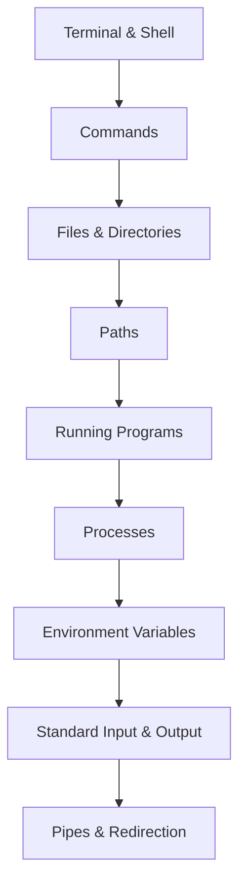

# 02 - Terminal & Development Environment

*`00-foundations/02-terminal/`, part of [Unslop](https://github.com/sage9705/unslop): don't be a vibe coder forever.*

## Overview

This section builds comfort with the terminal before backend work introduces processes, ports, servers, logs, and deployment.

The goal is narrow. Get comfortable enough with a shell prompt that it feels like a normal way of working, telling the computer what to do through typed commands, faster and more precise than clicking through menus once a handful of commands become familiar.

Every example reuses the shop programs already built in `01-programming`. You'll navigate to them, run them, inspect them, and occasionally break something in them on purpose, using the terminal the whole time.

---

## Why This Matters

A large share of real backend work happens through a terminal window, often connected to a machine sitting somewhere else entirely. Deploying an application, reading a server's logs, restarting a process that died overnight, all of that assumes shell fluency already exists. Building that fluency now, while the stakes are just practice files, means it's already there once something real is on the line.

---

## What You'll Learn

| Area | Topics |
|---|---|
| **Concepts** | the terminal and the shell, commands, files and directories, paths, running programs, processes, environment variables, standard input and output, pipes and redirection |
| **Tools** | navigation, file management, searching, inspecting processes, a handful of other everyday command line tools |

---

## Learning Path

Each concept builds on the one before it, the same way `01-programming` did. Directories come before paths make sense. Input and output come before pipes make sense.

---

## Where This Fits

`02-terminal/` follows `01-programming/` inside `00-foundations/`. It assumes comfort writing and running a small Python program, since most examples here reuse commands you've already been typing, just without necessarily thinking about what was happening underneath them.

Starting this with zero shell experience is completely normal, that's exactly who this section is written for.

---

## How to Learn

For each concept and each tool, follow the same loop:

1. **Understand** what's actually happening when you type the command, not just what to type.
2. **Try it** in your own terminal, on your own files, right now, while you're reading.
3. **Break it on purpose**, mistype something, run it from the wrong directory, and read the error that comes back.
4. **Fix it**, and notice exactly what changed.

A misspelled command or a "no such file or directory" message means the terminal found something specific and is reporting it plainly. Reading those messages calmly, all the way through, is most of what this section is actually training.

---

## Getting Unstuck

When a command doesn't do what you expected, `man <command>` or `<command> --help` explains exactly what it does and every option it accepts, straight from the tool itself. That habit alone answers most of the questions you'll run into here.

---

## What You Should Be Able to Do

By the end of this section, you should be able to:

- navigate an entire project from the terminal, without opening a graphical file browser
- explain the difference between a relative and an absolute path
- run a Python program from anywhere in your filesystem
- identify a process that's currently running, and explain what a process actually is
- stop a running process cleanly
- set and read an environment variable
- redirect a command's output into a file
- pipe the output of one command into another

---

## How This Folder Is Organized

| Folder | What It's For |
|---|---|
| `concepts/` | the mental models, what a shell, a process, or a path actually is, and why it matters |
| `tools/` | the actual commands, `pwd`, `ls`, `cd`, `grep`, `ps`, and the rest |
| `exercises/` | hands on tasks that use the terminal to get something done |
| `debugging/` | common terminal problems, presented as symptoms to investigate |
| `checkpoint.md` | a short self check before moving on |

Concepts explain what and why. Tools teach how. Keeping those separate makes each command far easier to actually remember, since it's already attached to a reason.

---

## The Real Goal

The most important thing you're learning here goes beyond a list of commands:

> When something on your computer isn't doing what you expect, can you investigate it yourself, calmly, and work out why?

That instinct, read the error, form a hypothesis, check it, carries directly into later work: a server that won't start, a deployment that fails, a process quietly eating memory it shouldn't be.

---

## Completion

You're ready to move on once you can navigate an entire project, run a program, inspect what's running on your machine, and fix a small terminal problem yourself.

**Next:** `00-foundations/03-files-and-data/`, where the files you can now navigate confidently become something you actually read, write, and reshape.
