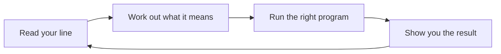

# Shell and Commands

*`00-foundations/02-terminal/concepts/02-shell-and-commands.md`, part of [Unslop](https://github.com/sage9705/unslop)*

> **Fundamental**

## The Question

What is actually reading what you type, and deciding what to do with it?

---

## The Terminal Is the Window, the Shell Is the Program

The terminal is the window sitting on your screen. Inside that window runs a separate program called the shell, and the shell is what actually reads your line, works out what you mean, finds the right program to run, runs it, and hands the result back to you.

Every terminal session runs this same loop the whole time it's open:



Type a line, the shell reads it, runs it, shows you what happened, then waits for your next line. That loop is running right now in every terminal window you have open.

---

## Anatomy of a Command

A command usually has two parts: the name of the program you want to run, and anything after it telling that program what to do.

```bash
python main.py
```

`python3` is the program being run. `main.py` is an argument, extra information passed to that program so it knows exactly what to do, in this case, which file to execute.

You already wrote and ran dozens of these throughout `01-programming`. Every `python3 main.py` you ran there followed this same shape.

---

## More Than One Shell Exists

Bash, zsh, and a handful of others are all shells, and you'll see both names mentioned depending on your operating system. They behave close enough to identically for everything you're doing right now that the difference barely matters at this stage. Pick whichever one your system starts you in and move on.

---

## Where This Shows Up

This same loop, read a line, run it, show the result, is exactly what happens later in Unslop when you restart a web server, run a database migration, or check whether a deployed program is still alive on a remote machine. The shell doesn't treat `pwd` any differently from a command that restarts a live production service, it reads and runs both the same way. That's precisely why understanding this loop early matters, the stakes of what you type go up, the mechanism underneath stays exactly the same.

---

## Try It

Type something that isn't a real command, on purpose:

```bash
bananacommand
```

Read what comes back. That message is the shell being completely honest with you, it looked for a program by that name, and it genuinely couldn't find one. That's the same mechanism that tells you, correctly, when you've mistyped something real.

---

## What You Need to Understand

- the shell is the program inside the terminal actually reading and running your commands
- every command has a name and, usually, arguments telling it what to do
- the shell's read, run, show, repeat loop runs constantly while a terminal is open
- an unrecognized command produces an honest error, not a broken terminal

---

## Exercise

Pick three commands you already ran during `01-programming`, running a Python file counts as one. For each, write down what you believe is the command name and what the arguments are.

> Work through this yourself, that's how terminal fluency actually forms. See the [section README](../README.md#the-golden-rule-zero-ai-code-generation) if you need the reminder.

---

## Checkpoint

Explain, in your own words:

1. What's the difference between the terminal and the shell?
2. In `python3 main.py`, which part is the command and which part is the argument?
3. What does the shell actually do when it can't find a command you typed?
