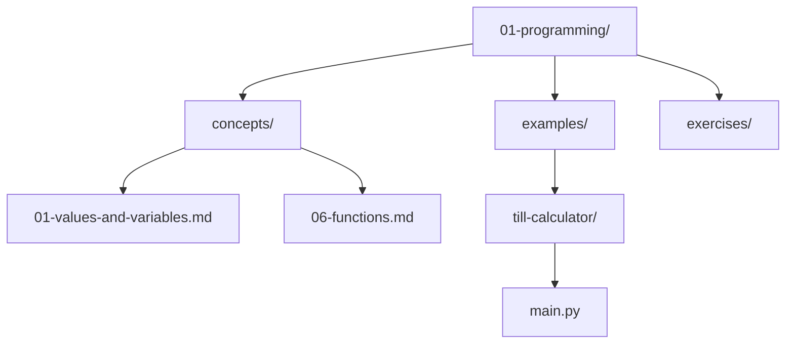

# Files and Directories

*`00-foundations/02-terminal/concepts/03-files-and-directories.md`, part of [Unslop](https://github.com/sage9705/unslop)*

> **Fundamental**

## The Question

How does your computer actually organize everything you save?

---

## Files

A file is a named chunk of stored data. `main.py`, `catalog.txt`, a photo, a song, all of these are files. They just hold different kinds of data inside them, text, code, images, sound, but structurally they're the same idea, a name pointing at some stored content.

## Directories

A directory, what you've probably always called a folder, holds files, and it can also hold other directories inside it. That nesting, folders inside folders inside folders, is what builds the whole tree structure your entire filesystem is made from.

Look at your own `01-programming` folder as a real example:

`01-programming` is a directory. `concepts` and `examples` are directories sitting inside it. Individual files like `01-values-and-variables.md` and `main.py` sit at the ends of those branches. That's the entire idea, nothing more mysterious than that.

---

## Root and Home

Every filesystem starts somewhere, a single starting point called the root, and every other file and directory on the machine lives somewhere underneath it. Your own user account also gets a home directory, a specific spot inside that whole tree set aside just for you, and most of your everyday files live somewhere inside it.

---

## Where This Shows Up

A server you deploy code to later in Unslop has this exact same tree structure sitting underneath it. Your application's files live in one set of directories, logs get written to another, configuration sits somewhere else again. Knowing how to navigate that tree confidently, without a graphical file browser to click through, becomes a daily skill the moment you start working with a real server.

---

## Try It

Open your regular file explorer or Finder window next to your terminal. Every folder you can see and click through in that graphical window is a directory that also exists in that exact same tree from the terminal's point of view. They're two different windows looking at the identical structure underneath.

---

## What You Need to Understand

- a file is a named chunk of stored data
- a directory holds files and other directories, creating a tree
- every filesystem has a root, and every user has a home directory somewhere under it
- a graphical file browser and a terminal are two views of the same underlying tree

---

## Exercise

Draw the directory tree of your own `01-programming` folder, two levels deep. Plain indentation on paper or in a text file is enough, no special tools needed.

> Work through this yourself, that's how terminal fluency actually forms. See the [section README](../README.md#the-golden-rule-zero-ai-code-generation) if you need the reminder.

---

## Checkpoint

Explain, in your own words:

1. What's the difference between a file and a directory?
2. What makes a filesystem a tree rather than a flat list?
3. What is your home directory, and why does it matter that you have one?
