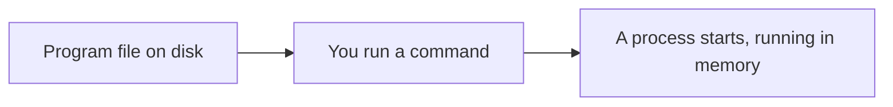

# Running Programs

*`00-foundations/02-terminal/concepts/05-running-programs.md`, part of [Unslop](https://github.com/sage9705/unslop)*

> **Fundamental**

## The Question

What actually happens between typing a command and seeing a program run?

---

## A Program Waiting to Happen

A program is a file sitting on disk, code, waiting. It does nothing on its own. `main.py` sitting inside `till-calculator/` is just text until something loads it and starts executing it line by line.

Typing this:

```bash
python main.py
```

is asking the shell to find the `python` program, hand it `main.py` as an argument, and let it start reading and running that file's contents from the top.

---

## Two Ways to Kick Something Off

Most of the time throughout `01-programming`, you ran a program by naming an interpreter first, `python`, and handing it a file. The interpreter does the actual running, your file is just instructions for it to follow.

Some files can also be marked as directly runnable on their own, without naming an interpreter first. The mechanics of setting that up belong in `tools/`, the concept worth holding onto here is simpler: a file becomes something the shell can execute directly, or it stays something another program has to read and interpret for you. Both end up doing the same thing, starting execution, just by a different route.

---

## Where This Shows Up

Every `self_check()` you ran throughout `01-programming` started the exact same way: you typed a command, the shell found the right program, handed it your file, and execution began. Deploying a real application later works on this identical idea, just at a bigger scale. A server that "won't start" is almost always this same process failing at one specific step, the shell couldn't find the program, or the file it was handed wasn't what it expected. Understanding what "running a program" actually means underneath makes that kind of failure a lot less mysterious to investigate.



Once a program is running, it becomes something with its own life while it executes, a process, which is exactly the next concept.

---

## Try It

Open a shop program you already built, and run it once from inside its own folder, then try running it again from a completely different directory. Notice what changes about how you have to refer to it.

---

## What You Need to Understand

- a program is inert code sitting on disk until something runs it
- running a command usually means asking an interpreter to load and execute a file
- starting a program is the moment it becomes an active process

---

## Exercise

Pick one program from `01-programming/examples/`. Run it. Then write one sentence describing what happened, in order, between the moment you pressed enter and the moment output appeared on screen.

---

## Checkpoint

Explain, in your own words:

1. What state is a program in before anyone runs it?
2. What's the difference between `python main.py` and a file you can run directly?
3. What does it mean for a program to "become" something once it starts running?
