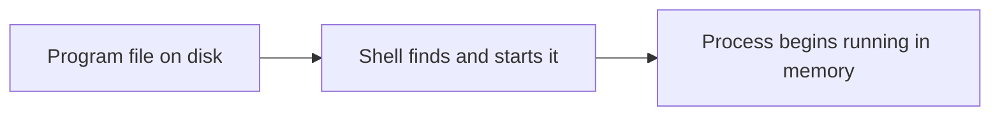

# Running Programs

*`00-foundations/02-terminal/concepts/05-running-programs.md`, part of [Unslop](https://github.com/sage9705/unslop)*

> **Fundamental**

## The Question

What actually happens between typing a command and seeing a program run?

---

## A program is just code until it is started

A program is a file sitting on disk. It contains instructions, but it is not doing anything yet. A file like `main.py` is only text on the drive until some program loads it and starts executing it line by line.

When you type:

```bash
python main.py
```

you are asking the shell to find the `python` program, pass it `main.py` as an argument, and let the Python interpreter read the file and run it.

The shell is not the program itself. It is the command runner that finds the right executable and hands off control.

---

## Two common ways to start a program

Most beginner programs are started by naming an interpreter first, then giving it a file to run:

```bash
python main.py
```

Here, Python is the thing doing the actual execution. Your file is the instructions.

Some programs are also made executable directly, so they can be started without an interpreter name:

```bash
./my-script
```

That works only when the file is marked as executable and the system knows how to run it. In either case, the result is the same: the operating system starts a process and that process begins executing the program.

The important idea is not which command syntax you used. The important idea is that a file on disk becomes a running thing only when the shell starts it.

---

## Why this matters in real projects

This is the same basic process behind every app you later run in a real environment. If a server will not start, the problem is often one of these:

- the shell cannot find the program
- the file is not in the expected location
- the file is not valid for the interpreter you asked it to use
- the file is not marked executable when you expect direct execution

Understanding this makes debugging much less mysterious. Instead of seeing "something failed to start," you can narrow it down to a specific step in the startup path.



Once execution begins, the program is no longer just a file. It is now a process, and that is the next concept.

---

## Try it

Open a shop program you already built and run it from inside its own folder. Then run it again from a different directory. Notice how the command has to be addressed differently depending on where you are.

---

## What you need to understand

- a program is inert code sitting on disk until it is launched
- the shell finds the executable and starts it
- running a program creates an active process in memory

---

## Exercise

Pick one program from `01-programming/examples/` and run it. Then write one sentence describing the order of events between pressing Enter and seeing output appear.

---

## Checkpoint

Explain, in your own words:

1. What state is a program in before anyone runs it?
2. What is the difference between `python main.py` and running a file directly?
3. What does it mean for a program to become a process when it starts running?
