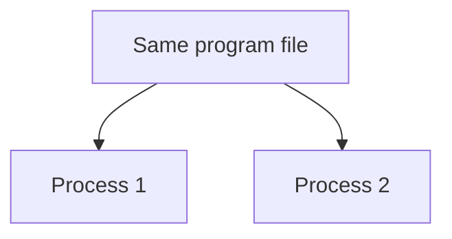

# Processes

*`00-foundations/02-terminal/concepts/06-processes.md`, part of [Unslop](https://github.com/sage9705/unslop)*

> **Fundamental**

## The Question

What is a process, and how is it different from the program that started it?

---

## A program becomes a process when it starts running

A program is a file on disk. It is code, but it is not alive in the way a running application is alive.

A process is the running version of that program. It has its own place in memory, its own current values, and its own lifetime while the operating system is executing it.

If you run the same program twice, you get two processes. They started from the same file, but they are not the same running instance. They each have their own memory and their own state.

That is why two terminal windows can both run the same shop program and each one keeps its own order totals, variables, and progress without interfering with the other.

---

## Your computer is managing many processes at once

The shell itself is a process. Your editor is a process. Your browser is a process. When you run `python main.py`, that becomes one more process alongside all the others already running.

Every process eventually ends. It may finish on its own, or it may be stopped by something else. The key point is that each process is a separate live instance of a program, not just a copy of the file sitting on disk.

This concept matters because real systems rarely have only one thing running. Once you move beyond toy exercises, your computer is constantly scheduling many tasks, and process management becomes a normal debugging skill.

---

## Where this shows up in real work

A web server is usually a process that stays alive for a long time and waits for requests. It does not simply run once and exit. A debugging session often involves identifying which process is doing what, which one is stuck, and which one you should stop without affecting the others.

The commands for inspecting and ending processes are covered later in `tools/`. This chapter is simply the mental model behind them.

---

## Try it

Open two terminal windows side by side. Run the same shop program in both. Then notice that they run independently, each with their own output and their own state, even though they came from the same source file.

---

## What you need to understand

- a program is code on disk
- a process is that program while it is actively running
- starting the same program twice creates two separate processes with separate memory
- processes end when the program finishes or is interrupted

---

## Exercise

Run the same program in two terminal windows at once. Write down what you expect to happen if the first process crashes midway through. Then explain why that expectation makes sense based on what a process actually is.

---

## Checkpoint

Explain, in your own words:

1. What is the difference between a program and a process?
2. If you run the same program three times at once, how many separate processes exist, and do they share state?
3. Why does a crash in one process not automatically affect another process running the same program?
