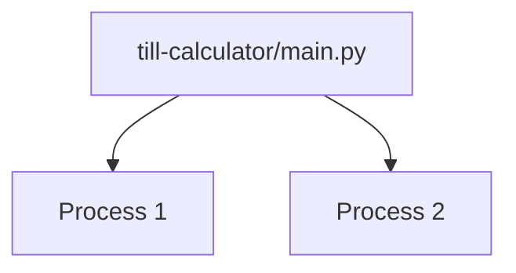

# Processes

*`00-foundations/02-terminal/concepts/06-processes.md`, part of [Unslop](https://github.com/sage9705/unslop)*

> **Fundamental**

## The Question

What is a process, and how is it different from the program that started it?

---

## A Program, Running

A program is code stored somewhere. A process is that program while it's running, with its own space in memory, its own current state, its own place in the operating system's attention.

Run the same program twice, and you get two separate processes. They came from the identical file, but once running, they know nothing about each other. Each one has its own memory, its own variables, its own life.

Open two terminal windows and run the same shop program in both at once, and that's exactly what you get, two independent processes, tracking their own separate order totals, unaware the other one even exists.

---

## Your Computer Is Juggling Many at Once

Your terminal itself is a process. Your browser is a process, or several. The moment you ran `python main.py`, that became one more process alongside all the others your operating system is already keeping track of. Every process eventually ends, either because the program finishes what it was doing on its own, or because something stops it early.

Keep this doc's scope narrow on purpose, exactly how the operating system schedules and juggles all of these at once is a deeper topic for later. What matters right now is the basic shape: a running program is a distinct, trackable thing with its own identity, separate from the file it came from.

---

## Where This Shows Up

A web server, covered later in Unslop, is a process kept running on purpose, sitting and waiting to answer request after request rather than finishing and exiting the way your shop programs did. Identifying which process is which, and stopping one that's misbehaving without disturbing anything else, becomes a routine skill the moment real servers enter the picture. `tools/04-inspecting-processes.md` covers exactly how to look at what's currently running and stop it, this doc is just the mental model that makes those commands make sense.

---

## Try It

Open two terminal windows side by side. Run the same shop program in both at the same time. Watch them print output independently, on their own schedule, with no coordination between them at all.

---

## What You Need to Understand

- a program is a file, a process is that program actively running
- running the same program twice creates two separate, independent processes
- every process eventually ends, on its own or from an outside stop

---

## Exercise

Run the same program in two terminal windows at once. Write down what you'd expect to happen to the second one if the first crashed partway through. Then think about why that expectation follows from what a process actually is.

---

## Checkpoint

Explain, in your own words:

1. What's the difference between a program and a process?
2. If you run the same program three times at once, how many separate processes exist, and do they share any state?
3. Why would crashing one process have no effect on a separate process running the same program?
