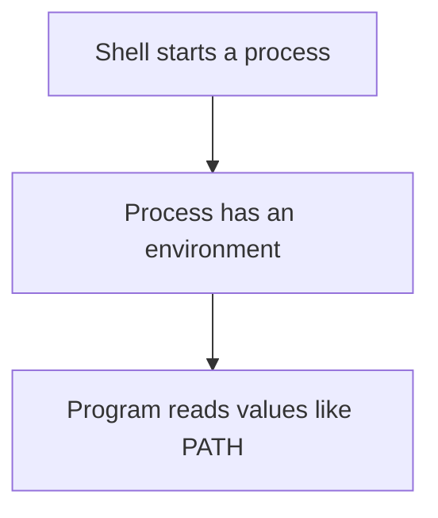

# Environment Variables

*`00-foundations/02-terminal/concepts/07-environment-variables.md`, part of [Unslop](https://github.com/sage9705/unslop)*

> **Fundamental**

## The Question

How does a process know details about its surroundings without you passing them in every time you run it?

---

## A variable inside a program is different from an environment variable

A Python variable like `price = 25.50` exists only inside one program while that program is running. It disappears when the program ends.

An environment variable lives at the process level. It is part of the environment that a process was started with, and it is available to the program while it runs. A child process usually inherits the environment from its parent process.

This is why a shell knows where common commands live, even though you did not write that information into your Python files.

---

## PATH is the most important example

When you type a command like `python`, the shell does not magically know where every program is stored. Instead, it checks a variable called `PATH`.

`PATH` is a list of folders the shell searches, in order. If the program you typed is in one of those folders, the shell can run it without you typing the full path.

This is what makes commands like `ls`, `git`, or `python` work from a terminal without your program needing to hardcode their filesystem locations.

---

## Why configuration is often stored in the environment

Hardcoding values like a shop name, a discount rate, or a database password into code is fine for a toy project, but real systems usually do not do that for configuration that changes by environment.

Instead, they read values from the environment at runtime. That way, the same code can run in development, testing, and production with different settings, without changing the source file.

This is especially important for secrets. A database password or API key should not be committed into code where it can be accidentally shared.

---

## Where this shows up in real systems

When an app is deployed later in Unslop, it often needs environment variables such as:

- a database URL
- a secret key
- the current mode, such as development or production
- a location for configuration files

A program that works locally but fails after deployment is often missing one of these expected environment variables. Understanding environment variables turns that from a confusing problem into a predictable first thing to investigate.

---

## Try it

Open a terminal and look at your shell's environment variables. Most systems already have several set, including one that points to your home directory and one that contains the command search path. The goal is not to memorize them all yet; it is to notice that programs start with information already provided to them.

---

## What you need to understand

- a variable inside a program is local to that program only
- an environment variable is part of the process environment and is available to the program while it runs
- `PATH` tells the shell where to look for executable commands
- real apps often read config and secrets from environment variables instead of hardcoding them

---

## Exercise

Pick one value you currently hardcode in a shop program, such as a discount rate, a shop name, or a tax rate. Write one sentence explaining why it would be better to read that value from the environment instead of writing it directly into the code.

---

## Checkpoint

Explain, in your own words:

1. What is the difference between a variable inside your Python program and an environment variable?
2. What does `PATH` do?
3. Why would a real application read a database password from the environment instead of embedding it in the code?
