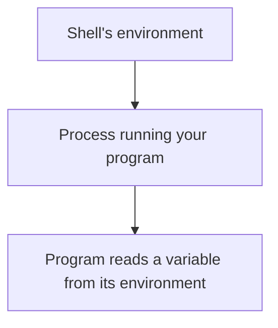

# Environment Variables

*`00-foundations/02-terminal/concepts/07-environment-variables.md`, part of [Unslop](https://github.com/sage9705/unslop)*

> **Fundamental**

## The Question

How does a process know things about its surroundings without you telling it directly every single time?

---

## A Variable Living Outside Any Single Program

A Python variable like `price = 25.50` lives inside one program, while that program runs, and disappears the moment it ends. An environment variable lives one level up, at the level of the process itself, available to whatever program that process happens to be running, and often passed down automatically to any program that process goes on to start.

One environment variable is already working quietly in the background every time you type a command. When you run `python`, the shell has to know where the actual `python` program lives on disk. A variable named `PATH` holds a list of folders the shell checks, in order, whenever you type a command name. That's the entire reason typing `python` works without spelling out its exact location every time, `PATH` already told the shell where to look.

---

## Configuration Without Hardcoding

Right now, your shop programs have things like a discount rate or a shop name written directly into the code. That's fine for practice, but real backend systems avoid hardcoding exactly this kind of detail, especially anything sensitive, a database password, an API key, which environment the code is currently running in, development or production.

Instead, that information gets read from the environment the process is running inside. The same program, run with a different environment, can connect to a different database or behave slightly differently, without a single line of code changing.

---

## Where This Shows Up

Deploying an application later in Unslop always involves setting environment variables, telling the running process where its database lives, what secret key to use, which mode to run in. A program that "works perfectly on my machine" and then fails the moment it's deployed somewhere else is very often missing an environment variable it silently assumed would be there. Understanding this concept now turns that failure from a mystery into an obvious first thing to check.

---

## Try It

Your shell already carries several environment variables the moment it starts, one of them typically points at your own home directory. `tools/` covers exactly how to look at these directly, for now just hold onto the idea that your shell was born with information already sitting in its surroundings, waiting to be read.

---

## What You Need to Understand

- an environment variable exists at the level of the process, not inside any single program's code
- `PATH` is the environment variable that lets the shell find programs by name
- real configuration, especially secrets, gets read from the environment instead of written directly into code

---

## Exercise

Pick one thing currently hardcoded in a shop program you've written, a discount rate, a shop name, a tax rate. Write a sentence explaining why that value might make more sense read from the environment instead of baked directly into the file.

---

## Checkpoint

Explain, in your own words:

1. What's the difference between a variable inside your Python program and an environment variable?
2. What does `PATH` actually do?
3. Why would a real application read a database password from the environment instead of writing it directly into the code?
