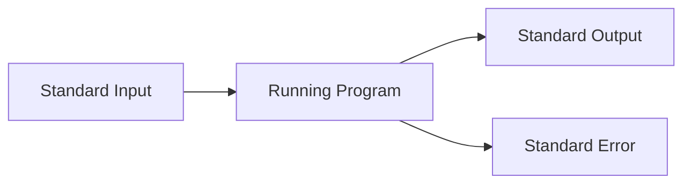

# Standard Input and Output

*`00-foundations/02-terminal/concepts/08-standard-input-output.md`, part of [Unslop](https://github.com/sage9705/unslop)*

> **Fundamental**

## The Question

How does a program receive input and send output underneath a simple `print()` or `input()` call?

---

## Every process has three default streams

Every process starts with three standard streams already connected:

- standard input (`stdin`): where typed input comes from
- standard output (`stdout`): where normal results are written
- standard error (`stderr`): where error messages are written

By default, all three are attached to your terminal window. That is why a program can read what you type and print text without you needing to specify where those streams should go.

When you call `input()`, the program is reading from standard input. When you call `print()`, the program is writing to standard output.

---

## Why standard error is separate

Both standard output and standard error usually appear in the terminal, so they can look similar on screen. They are still different channels, and that difference matters.

A normal success message belongs on standard output. An exception or traceback belongs on standard error. Keeping them separate allows programs, scripts, and later tools to decide whether to show, filter, or log each kind of output differently.

This is especially useful when diagnosing broken programs. A traceback is not "the same kind of thing" as regular progress output, even if both appear in the same terminal window.

---

## Where this shows up in real systems

Long-running systems often send their output to logs, and those logs usually separate normal activity from warnings and errors. Understanding standard streams helps you read those logs with more intention.

If you know the difference between normal output and error output, you can quickly tell whether a system is behaving as expected or is failing in a specific way.

---

## Try it

Run a shop program that produces both normal output and an error, or deliberately trigger a failing command. Notice that both messages can appear in the same terminal, even though they are conceptually going through different channels.

---

## What you need to understand

- every process starts with standard input, standard output, and standard error
- `print()` writes to standard output
- `input()` reads from standard input
- error messages go to standard error so they can be treated separately from normal results

---

## Exercise

Pick a shop program and find one line that writes output to the terminal. Then write one sentence describing what would need to change for that same message to be saved into a file instead of appearing on screen.

---

## Checkpoint

Explain, in your own words:

1. What are the three standard streams every process starts with?
2. Which stream does `print()` write to, and which one does `input()` read from?
3. Why is standard error kept separate from standard output instead of being merged into one stream?
